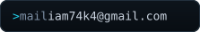
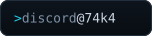
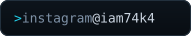

<!-- one continuous terminal session: every panel shares the same window
     chrome, palette (#0d1117 bg / #c9d1d9 ink / #39d353 green accent) and
     monospace type.
     portrait:  python scripts/make_ascii_svg.py
     wordmark:  python scripts/make_wordmark_svg.py --mode rock
     heatmap:   python scripts/fetch_commit_activity.py
                && python scripts/generate_streak_svg.py   (daily via Actions)
     links:     python scripts/make_links_svg.py
     profile-art concept inspired by github.com/AVIVASHISHTA29 -->

<table>
<tr>
<td valign="top"></td>
<td valign="top"></td>
</tr>
</table>

 
 

 

profile art inspired by <a href="https://github.com/AVIVASHISHTA29">@AVIVASHISHTA29</a>

