<!-- the board is one SVG, so GitHub has no layout of its own to get wrong:
     the cards keep their positions and sizes at every width.
     palette: #080d12 bg / #cbd5e1 ink / #22d3ee accent, monospace throughout.
     board:     python scripts/fetch_commit_activity.py
                && python scripts/make_dashboard_svg.py   (daily via Actions)
     portrait:  python scripts/make_ascii_svg.py          (feeds the board)
     wordmark:  python scripts/make_wordmark_svg.py --mode rock
     links:     python scripts/make_links_svg.py   -- separate files on purpose:
                an SVG behind  cannot carry clickable areas, so only these
                chips can be wrapped in a link.
     portrait and wordmark need Pillow + numpy:
                pip install -r scripts/requirements.txt
     the earlier stacked panels (heatmap / stats / stack) still build from
     their own scripts in scripts/. -->

 

