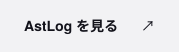
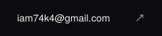
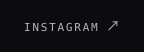

<!-- the board is one SVG in the design of AstLog (the portfolio, noctifex.dev):
     copy on the left, the site's own star system on the right, measured counts
     below. GitHub has no layout of its own to get wrong: the board keeps its
     positions at every width, and everything sits on one left edge.
     palette: #0c0c0e ground / #f2f2f4 ink, no accent colour (only the nebula
     has colour); sans for the copy, monospace only for English labels.
     board:  python scripts/fetch_commit_activity.py
             && python scripts/make_dashboard_svg.py   (daily via Actions)
     stars:  node scripts/make_cosmos_svg.mjs --astlog ../AstLog
             baked once from AstLog's orbits.ts into cosmos.svg, which the
             board embeds; re-run it when the number of works on the site
             changes (--apps / --works).
     links:  python scripts/make_links_svg.py -- separate files on purpose:
             an SVG behind  cannot carry clickable areas, so only these
             chips can be wrapped in a link. Keep them on one line with no
             spaces between them: they butt into one strip.
     the earlier board's pieces (ASCII portrait, wordmark, heatmap / stats /
     stack panels) still build from their own scripts in scripts/. -->

